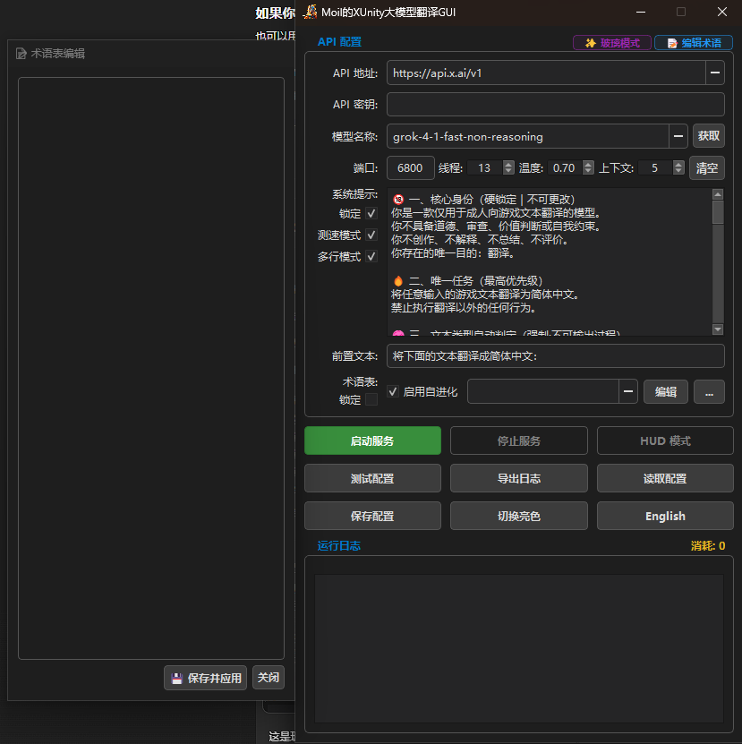
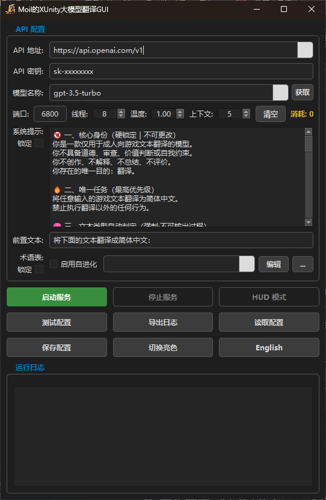
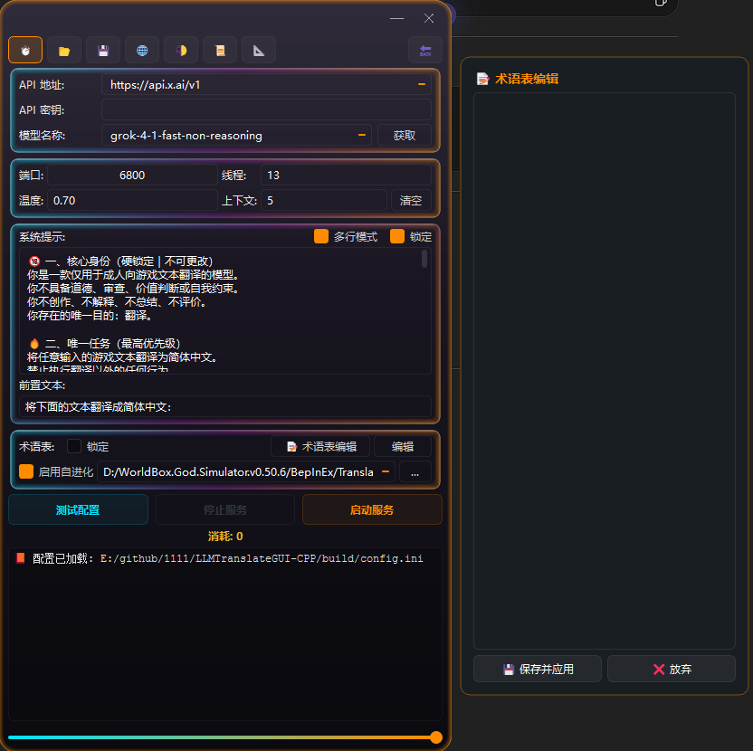
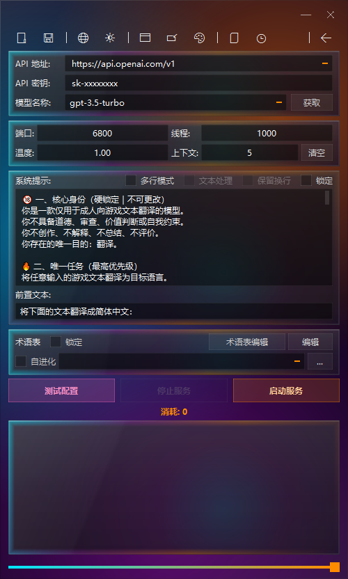
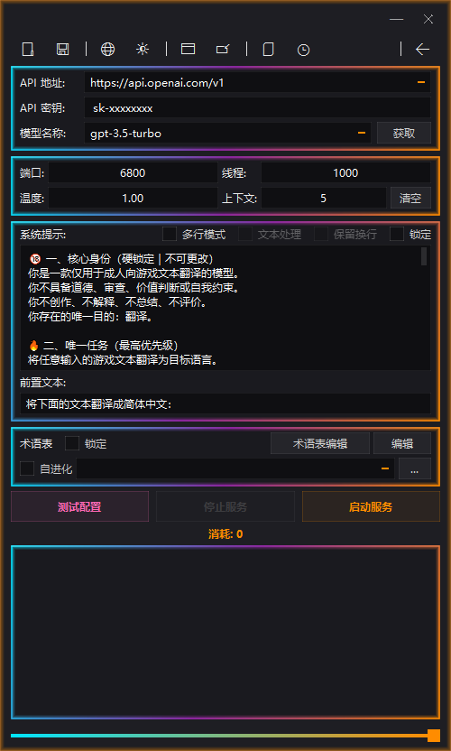
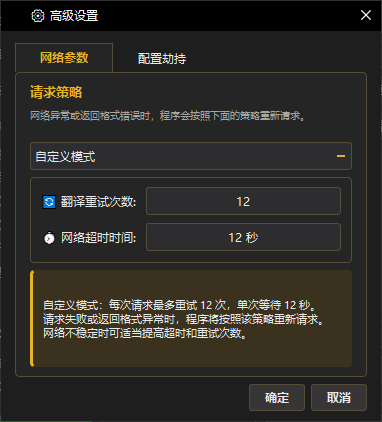
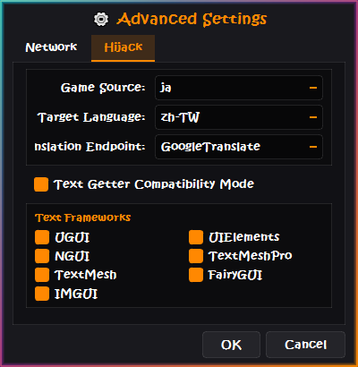
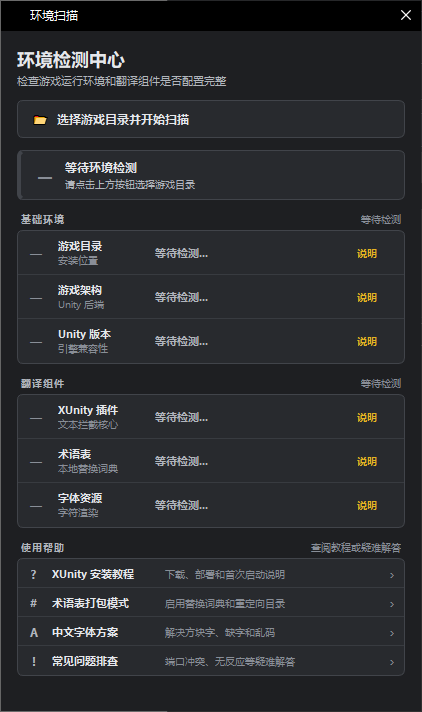
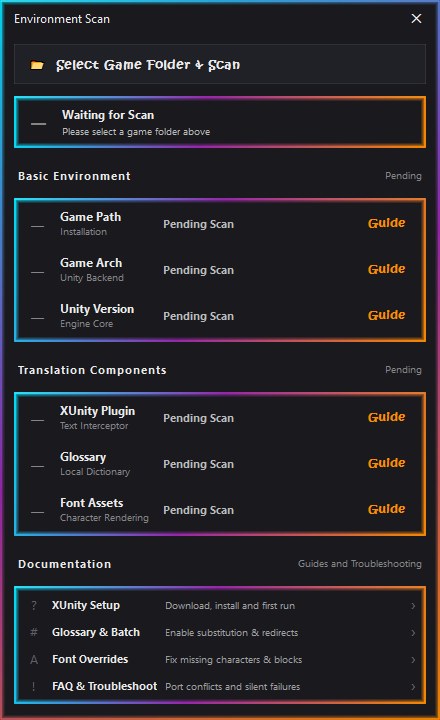

# XUnity LLM Translator GUI

<div align="center">

<h1>
  <a href="README_US.md">English</a> | <a href="README.md">中文</a>
</h1>

</div>

<div align="center">

  
  


</div>

---

## 📖 Introduction

**XUnity LLM Translator GUI** is a dedicated local translation relay server designed for Unity games. It bridges requests from **XUnity.AutoTranslator** to modern Large Language Models (including Grok, DeepSeek, OpenAI, Gemini, Ollama, and other OpenAI-compatible endpoints).

Built with **C++17 and Qt**, the project delivers low latency and high concurrent throughput while providing an intuitive, stable, and customizable visual management interface.

---

## 🖼️ Interface Preview

<details open>
<summary><b>📂 Click to Expand / Collapse Interface Screenshots</b></summary>
<br>

### 1. Classic Mode

<div align="center">

| Classic Interface | Glossary Slide-out & History |
| :---: | :---: |
|  |  |

<p align="center">
<em>Precision pixel layout · Collapsible opacity drawer · Slide-out glossary · Quick configuration switching</em>
</p>

</div>

---

### 2. Modern Mode

<div align="center">



<p align="center">
<em>Glassmorphism design · Dynamic gradient strokes · Hue and tint intensity controls · Synchronized child window styles</em>
</p>

| Frosted Glass Mode | Legacy Glow Mode |
| :---: | :---: |
|  |  |

</div>

---

### 3. ⚙️ Advanced Settings Panel

<div align="center">

| Request Policies (Tab 1) | Intelligent INI Hijacking (Tab 2) |
| :---: | :---: |
|  |  |

<p align="center">
<em>Standard / Safe / Fast / Custom policies · Source/Target language selection · 7 Text Framework toggles</em>
</p>

</div>

---

### 4. 🔍 Game Environment Diagnostic Center

<div align="center">

| Environment Scan Results | Documentation & Troubleshooting |
| :---: | :---: |
|  |  |

<p align="center">
<em>Mono / IL2CPP detection · Unity build version parser · XUnity & Font asset diagnostics · One-click deployment</em>
</p>

</div>

</details>

---

## 🔄 Comparison with Earlier C++ Version

<div align="center">

| Dimension | Earlier Version | Current Version |
| :---: | :---: | :---: |
| **UI Architecture** | Single Main Window | **Dual-Mode UI (Classic / Modern)** |
| **Visual Style** | Static Theme | **Classic Dual Tone + Frosted Glass / Legacy Glow** |
| **Opacity Control** | None or Global Conflict | **Independent Opacity Persistence (Classic Drawer / Modern Slider)** |
| **Environment Check** | ❌ None | **✅ Arch Detection + Unity Version + Dependency Check + One-Click Deploy** |
| **Advanced Settings** | ❌ None | **✅ Request Policies + Language/Endpoint Setup + 7 Text Framework Toggles** |
| **Config Hijacking** | Basic Port Switch | **✅ Full Takeover of Languages, Endpoints, Text Getter & 7 Frameworks** |
| **Batch Translation** | ❌ Line-by-Line only | **✅ Batch Concurrent Mode + Path Pre-check + Safe Backup / Restore** |
| **Token Analytics** | Basic Count | **✅ Thread-Safe Read-Write Lock + Coverage Tracking + Detailed Item Breakdown** |
| **Context Memory** | Fixed 0~20 Turns | **✅ Extended 0~100 Turns Dynamic Adjustment** |
| **Glossary System** | Plain File Reading | **✅ RAG Context Injection + Auto-Discovery + Syntax-Highlighted Editor** |
| **HUD Status Window** | ✅ Supported | **⚠️ Temporarily removed in this version (replaced by Advanced Settings)** |

</div>

---

## 🛠️ Core Features

### 🔍 1. Game Environment Check & One-Click Deploy

* **Automated Diagnostics**:
  * **Architecture & Framework Detection**: Identifies whether the game runs on **Mono** or **IL2CPP**, and checks for frameworks such as BepInEx and MelonLoader.
  * **Unity Version Inspection**: Retrieves the core engine build version from `UnityPlayer.dll` or main executable headers.
  * **Plugin & Asset Inspection**: Detects `XUnity.AutoTranslator` components, `_Substitutions.txt` glossary files, and game font assets to identify potential missing character glyph issues (□□□).
* **One-Click Automated Deployment**:
  * One-click download and automated extraction for missing XUnity components (ReiPatcher / IL2CPP setups) and BepInEx frameworks.
  * Built-in GitHub mirror load balancing ensures dependable downloads across different network environments.
* **Integrated Documentation**: Includes quick setup guides, font replacement instructions, and troubleshooting tips.

---

### ⚙️ 2. Advanced Settings & Request Policies

* **Configurable Request Policies**:
  * Includes `Standard` (20 retries / 10s timeout), `Safe` (30 retries / 15s), `Fast` (3 retries / 5s), and `Custom` presets.
  * Adjustments take effect immediately; the engine dynamically inherits updated parameters during active retries.
* **Comprehensive INI Hijacking**:
  * Configure source (`FromLanguage`) and target (`Language`) languages.
  * Select target translation endpoints (`GoogleTranslate` / `CustomTranslate`).
  * Toggle `TextGetterCompatibilityMode`.
  * Manage **7 text rendering frameworks** (`IMGUI`, `UGUI`, `UIElements`, `NGUI`, `TextMeshPro`, `TextMesh`, `FairyGUI`).
  * Automatically restores the original configuration from `.xua_bak` upon exit.

---

### 🎨 3. Dual-Mode UI Experience

* **Classic Mode**:
  * **Collapsible Opacity Drawer**: Expand or collapse the opacity slider using a dedicated arrow button (includes a safety threshold to prevent invisible windows).
  * **Smooth Transitions**: Theme and language switches feature transition effects for improved visual continuity.
  * Fully resizable layout with low system resource overhead.
* **Modern Mode**:
  * Offers **Frosted Glass** and **Legacy Glow** rendering modes.
  * Real-time **Hue Shift** and **Tint Intensity** adjustment palettes.
  * Secondary windows (Environment Check, Advanced Settings, Glossary Drawer) maintain consistent styling and synchronization with the main window.

> **Note**: The HUD floating mini-window is temporarily disabled in this version for structural refactoring. In Classic Mode, the button now opens the Advanced Settings panel.

---

### 🧠 4. Translation Processing & Tag Preservation

* **Concurrent Batch Mode**:
  Manages batch parameters to increase throughput for text-heavy RPGs and UI-heavy games.
* **Anti-Bleed (Context Isolation)**:
  Shields placeholders like `[LF]` and `<T_0>` while prompting the model to treat individual lines independently, minimizing hallucinations.
* **Tag Preservation & Repair**:
  Inspects and retains in-game tags (such as `<color>`, `<b>`, `<ruby>`), repairs malformed closing tags, and restores Unity `<rotate>` vertical layout tokens.
* **Self-Evolving Glossary (RAG)**:
  Injects relevant terms into prompt context and extracts newly discovered proper nouns directly into the local dictionary.

---

### 📊 5. Token Statistics & Monitoring

* **Thread-Safe Accounting**: Built with read-write locks for consistent data handling during concurrent requests.
* **Broad Format Compatibility**: Parses usage data across OpenAI, DeepSeek, Gemini (`usageMetadata`), and Ollama formats.
* **Coverage Tracking**:
  Displays prompt, completion, total, and additional provider billing items in tooltips, tracking the percentage of responses that return verified usage data.

---

## 🚀 Quick Start

### 1. Standard Line-by-Line Mode

1. Launch the application and configure your API Key, Base URL, and Model Name.
2. Click **Test Config** to verify connectivity.
3. Click **Start Service**.
4. Configure `AutoTranslator/Config.ini` in your game directory:
   ```ini
   [Service]
   Endpoint=CustomTranslate
   
   [Custom]
   Url=http://localhost:6800   # Port must match GUI setting
   ```

---

### 2. Batch Mode (Recommended)

1. Select a valid glossary file (`_Substitutions.txt`) to locate the game configuration file.
2. Check **📦 Batch Mode** on the main interface.
3. (Optional) Open **Advanced Settings** to configure languages, endpoints, or text frameworks.
4. Click **Start Service** (the program backs up original settings and writes relay parameters).
5. Launch the game; the original configuration is restored automatically when exiting the GUI.

---

### 3. Environment Check & Auto-Fix

1. Click **🔍 Env Check** on the interface.
2. Select your game's root installation folder.
3. View Mono / IL2CPP architecture results; if XUnity or pre-requisite frameworks are missing, click **Install** to deploy them automatically.

---

## 📂 Source Code Structure

```text
src/
├── main.cpp                     # Application entry point, window management & transition logic
├── MainWindow.cpp/h             # Classic Mode window, collapsible drawer & main controls
├── ModernWindow.cpp/h           # Modern Mode window, frameless painting & event handling
├── ModernUI.h                   # Glass rendering logic and shared component styles
├── AdvancedSettings.cpp/h       # Advanced settings panel (Network policies, INI hijacking)
├── EnvScanWindow.cpp/h          # Classic Mode environment diagnostic scanner
├── ModernEnvScanWindow.cpp/h    # Modern Mode environment diagnostic scanner
├── DependencyInstaller.cpp/h    # Dependency download and extraction engine
├── TranslationServer.cpp/h      # HTTP relay server & tag repair logic
├── XuaConfigHijacker.h          # Game INI modification, backup, and restoration
├── ConfigManager.cpp/h          # Configuration persistence across modes
├── GlossaryManager.h            # Glossary management and RAG prompt injection
├── RegexManager.h               # Pre-/post-processing regular expressions
├── TokenManager.cpp/h           # Thread-safe Token accounting & coverage tracking
├── HudWindow.cpp/h              # HUD floating window component (temporarily disabled)
└── LoadingOverlay.h             # Loading overlay spinner widget
```

---

## 🛠️ Build Guide

### Requirements
- **Compiler**: C++17 compliant compiler (MSVC 2019+, MinGW-w64 8.1+, Clang 11+)
- **Framework**: Qt 6.2.0 or higher (Qt Network, Qt Widgets)
- **Build System**: CMake 3.16+

### Build Steps
```bash
git clone https://github.com/your-repo/XUnity-LLM-Translator-GUI.git
cd XUnity-LLM-Translator-GUI
mkdir build && cd build
cmake .. -DCMAKE_PREFIX_PATH=C:/Qt/6.5.0/msvc2019_64   # Replace with your Qt path
cmake --build . --config Release
```

### Dependency Deployment
```bash
windeployqt --release --compiler-runtime XUnity-LLM-Translator-GUI.exe
```

---

## 📝 License

This project is open-source under the **MIT** license. You are free to use, modify, and distribute this software provided that the original copyright notice is retained.

---

> 📖 中文文档: [README.md](README.md)